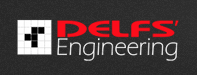

# Introduction

## 

## FM BetterForms

> #### A loosely coupled high performance front end web publishing framework and application that allows FileMaker database developers to build anything from form widgets to full web apps.

FM BetterForms makes it easy to create high performance web applications and forms without any deep knowledge of JavaScript or web technologies.

* Mobile first responsive design
* Publish and process forms, data and pages
* Build connected widgets ready to be placed into existing websites
* Publish data and tables
* Use 3rd party JS modules easily

# Contributing

### Documentation Contributions
If you see something that you can contribute, we would LOVE a pull request with your edits! To make this easy you can click the _"Edit this page"_ link at the top of the web docs.

The docs are all written in [GitHub Flavored Markdown](https://help.github.com/articles/github-flavored-markdown/).  If you've used GitHub, it's pretty likely you've encountered it before.  You can become a pro in a few minutes by reading their [GFM Documentation page](https://help.github.com/articles/github-flavored-markdown/).

### Filemaker Code Snippets 
If you have Filemaker script code suggestions and code contributions we would love to see them. You can and the files to a pull request or open an issue here. 

### BetterForms Schema trick, and tips
For contributing schema tricks and techniques please create a pull request or open an issue and we will add them to the Tips and tricks document here.

**Author**
Delfs' Engineering
TORONTO CANADA
www.fmbetterforms.com

***

***
