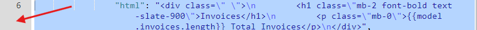

# Page Builder

### Page Schema

The Page Schema is the backbone of your app's pages, defining all elements that will appear. It is structured in JSON format and includes groups and fields that organize and detail these elements.

### \_note Property

The `_note` property (e.g., `"HEADER"`) is a user-defined label used for organizing the schema. It helps you structure and label different parts of your page without rendering anything on the actual page. This property can be applied to groups, fields, or any sub-contents.

### Groups and Fields

* <mark style="color:red;">**`"groups"`**</mark>: These organize fields into logical sections like "header," "body," or any custom section you create.
* <mark style="color:red;">**`"fields"`**</mark>: Fields contain the actual elements, such as HTML, buttons, or other components, that will appear on your page.

### Styling and Visibility of Elements

* <mark style="color:red;">**`"styleClasses"`**</mark>: This property applies Tailwind CSS or any custom styles defined in the DOM header insertions and CSS.
* **Dynamic Visibility**: Elements can have <mark style="color:red;">`"visible": false`</mark> for static rendering or <mark style="color:red;">`"visible_calc"`</mark> for dynamic rendering based on the data model. For example,&#x20;

```json
"visible_calc": "model.isShowing"
```

### Input Field Validation

* **Validators**: Input fields can include validators to ensure data integrity. For example:
  * A simple type validator: <mark style="color:red;">`"validator": "string"`</mark>
  *   A dynamic validator:

      ```json
      {
        "validator": "calc",
        "validator_calc": "model.user.firstName"
      }
      ```
  * **Error Messages**: You can set an error message with the `"errorMsg"` key
*   **Triggering Validation**: For HTML content input fields, you need a button or an `@change` event to trigger a `namedAction`. Then, copy the `validate` action snippet from the library:

    ```json
    {
        "action": "validate",
        "onFailed_actions": []
    }
    ```

### Using Snippets

To add a snippet from the Snippet Library, copy the desired snippet and paste it in your Page Schema. This allows you to quickly add elements like buttons or custom HTML to your page.

### Managing JSON Structure

In your editor, you can use the top-right toolbar to fold or unfold page schema objects or nested elements at different levels. This feature helps you manage and navigate through complex JSON structures. Additionally, you have the option to format the JSON, ensuring that the code is neatly organized and easy to read—especially useful for large and detailed page schemas.

### Editing HTML Content

When working with HTML content within the Page Schema, clicking on the line number of an HTML field will open an HTML editor. This allows you to directly edit the HTML code in a more user-friendly interface, making it easier to customize your content and layout.

<figure><figcaption></figcaption></figure>

#### HTML Editor Features

In the HTML Editor, you can:

* **Edit HTML content**: Directly modify HTML elements and see real-time updates.
* **Edit Data Models**: Modify both the main data model and the development data model JSON.
* **Toggle DEV Mode**: Use the DEV button in the top right corner to enable or disable the development data model.
* **AI Assistant**: You can ask the AI assistant for help, and it will automatically modify the HTML content based on your requests.

Remember to **save** your changes before closing the HTML Editor**.** After that, be sure to **save** the entire page to ensure all modifications are stored.
