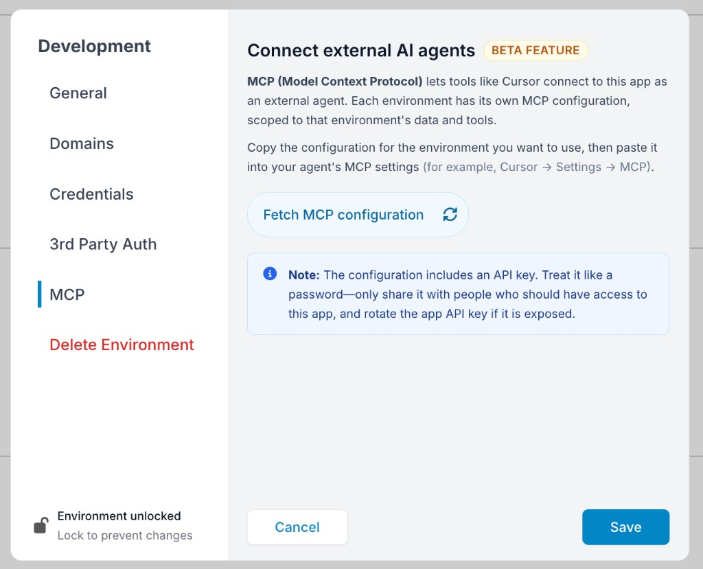

# Klai Studio MCP (Beta)


This is a **beta feature**. Capabilities and configuration may change. Do not paste real API keys into docs, tickets, or chat logs.


## What this is

Klai Studio exposes a Model Context Protocol (MCP) server so MCP-capable developer tools (Cursor, Claude Desktop, and others) can create and edit Klai Studio pages from outside the Klai Studio app.

The key unlock is that this can be combined with domain-native tools (for example the Gene AI FileMaker Plugin) to enable near agentic, full-stack workflows, while keeping Klai as the system of record for the artifacts.

This is primarily used to let a developer stay in their IDE or assistant client while still operating directly on Klai Studio content.

## High-level architecture

1. **MCP client** (Cursor, Claude Desktop, other MCP-capable tool)
   - Loads an MCP server definition from a local config file.
   - Surfaces the Klai Studio tools to the user (and to the model) as callable actions.
2. **Klai Studio MCP server**
   - Implements the MCP protocol (tool discovery + tool invocation).
   - Translates MCP tool calls into Klai Studio operations (page create, update, and so on).
3. **Klai Studio backend**
   - Applies the requested mutations.
   - Enforces authentication and authorization.
   - Records and returns results.

## Operational overview

- The MCP client calls the Klai Studio MCP server tools.
- The MCP server executes those operations against Klai Studio.

## Developer setup (Cursor + Claude Desktop)

This section documents how to wire MCP clients to the Klai Studio MCP server locally.

### Get the MCP configuration from Klai Studio

Before editing your MCP client config, fetch the environment-scoped configuration from Klai Studio:

1. Open your app in Klai Studio.
2. Open **Development** settings for the environment you want to connect to (for example **Development**, **Staging**, or **Production**).
3. Select **MCP** in the sidebar.
4. Click **Fetch MCP configuration**.
5. Copy the generated configuration for that environment.

<figure><figcaption></figcaption></figure>

Each environment has its own MCP configuration, scoped to that environment's data and tools. Use the config for the environment you intend the external agent to work in.


The configuration includes an API key. Treat it like a password — only share it with people who should have access to this app, and rotate the app API key if it is exposed.


### Add the config to your MCP client

Paste the copied configuration into your agent's MCP settings (for example **Cursor → Settings → MCP**).

### Cursor

1. Open Cursor Settings.
2. Navigate to **Tools** → **MCP**.
3. Choose **Add new MCP server** (Cursor opens the `mcp.json` config file).
4. Paste or merge the Klai Studio MCP server config entry you copied from Klai Studio.
5. Restart Cursor if needed.

### Claude Desktop

1. Open the menu (top left).
2. Hover **Developer** → click **Open app config file**.
3. Paste or merge the Klai Studio MCP server config entry you copied from Klai Studio.

### Config shape (example)

Values shown below are illustrative. Do not paste real API keys into docs.

```json
{
  "mcpServers": {
    "Acme Invoice System": {
      "url": "https://app.klai.studio/mcp",
      "headers": {
        "X-Api-Key": "BFAPI_REDACTED",
        "X-BF-Env-Name": "Development",
        "X-BF-Id-Site": "ST_REDACTED",
        "X-BF-Id-User": "USER_REDACTED"
      }
    }
  }
}
```

| Header | Purpose |
| :--- | :--- |
| `X-Api-Key` | App API key for the selected Klai Studio app/environment |
| `X-BF-Env-Name` | Environment name (for example `Development`, `Staging`, `Production`) |
| `X-BF-Id-Site` | Site identifier for the app you are connecting to |
| `X-BF-Id-User` | User identifier for the authenticated Klai Studio user |

## Supported capabilities

This MCP is intended for external creation and editing workflows in Klai Studio. Individual MCP tools are discovered automatically by the client when the server is connected; this guide does not enumerate each tool.

## Why this matters (agentic full-stack workflows)

When the Klai Studio MCP server is combined with external, domain-specific tooling (for example the Gene AI FileMaker Plugin), you can get close to fully agentic full-stack engineering:

- **UI + Klai Studio artifacts** can be created and edited from the IDE via MCP.
- **FileMaker schema/scripts/data workflows** can be manipulated via FileMaker-native tooling.
- The developer (and the review surface in Klai) stays in the loop, but the execution can be heavily automated.

Practically, this means an agent can move from idea to working change across the whole stack (spec, UI, integration points, backend objects) without constantly context-switching between tools.

## Related docs

- [AI Assistant - Tips & Tricks](../../cookbook-coming-soon/ai-assistant-tips-and-tricks.md) — in-app AI and streaming APIs
- [BF Streaming API (Assistants)](../../apis-and-services/bf-streaming-assistants-api.md)
- [BF Streaming API (LLM Query)](../../apis-and-services/bf-streaming-api-llm-query.md)
