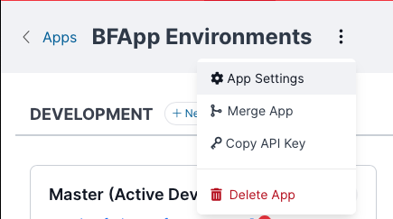
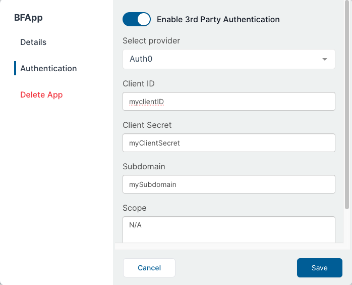
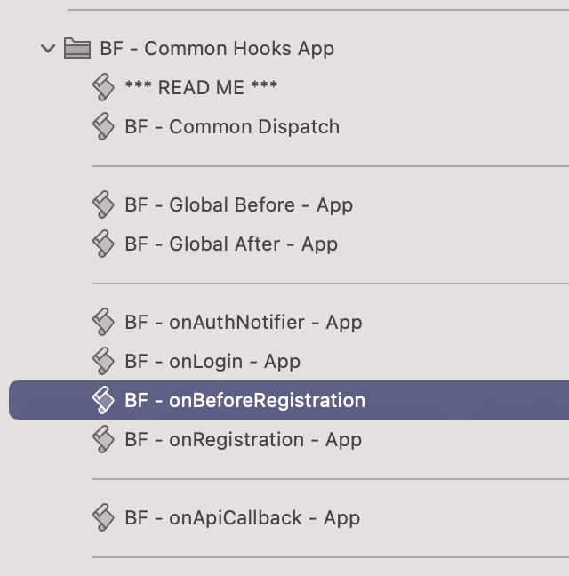

# Setting up Auth0

Auth0 is one of the OAuth providers supported by BetterForms.

Before using this guide, make sure you have already set up the shared BetterForms OAuth requirements in the canonical reference:

- [OAuth](../../reference/authentication/oauth.md)

That page covers the BetterForms-side flow, required callback page, `authLoginOauth`, `Users.oauthId`, and `onBeforeRegistration`.

## What Is Auth0-Specific

For Auth0, the main provider-specific pieces are:

- Create an Auth0 application of type `Regular Web Application`
- Add the BetterForms callback URL to the application
- Copy the Auth0 credentials into BetterForms
- Optionally enable Auth0 database or social connections for the login methods you want

## Create the Auth0 Application

In Auth0, create or open the application that will be used for BetterForms and choose:

- Application type: `Regular Web Application`

## Allowed Callback URLs

In the Auth0 application settings, add:

```text
https://yourapp.domain.com/oauth/auth0/callback
```

If the same BetterForms app is reachable on multiple domains, add each callback URL as a comma-separated entry in Auth0.

## Credentials to Copy Into BetterForms

BetterForms expects the Auth0 provider credentials for the app or tenant:

In BetterForms, open the app environment menu, choose `App Settings`, and then go to the authentication settings for the app:

<figure><figcaption></figcaption></figure>

The Auth0 provider fields in BetterForms look like this:

<figure><figcaption></figcaption></figure>

- Client ID
- Client Secret
- Subdomain

For the `Subdomain` field, use only the Auth0 subdomain portion, not the full URL.

Example:

- Auth0 domain: `yourtenant.us.auth0.com`
- BetterForms subdomain value: `yourtenant.us`

## Auth0 Login Options

Auth0 can present different login methods depending on what you enable in Auth0:

- Auth0 database connection for username/password login
- Social or enterprise connections for external identity providers

Those choices are managed in Auth0. BetterForms still completes the sign-in through the same OAuth callback flow.

## Allowing New Users

If OAuth users should be allowed to create BetterForms users automatically, your FileMaker integration must support the `onBeforeRegistration` hook and return `model.createUser = true` when registration should proceed.

This is the FileMaker-side hook location commonly used for that setup:

<figure><figcaption></figcaption></figure>

If that hook is missing, or if it does not allow the user, BetterForms will not create the new account.

## Optional: Force a Full Auth0 Logout

`authLogout` clears the BetterForms session. If you also need to clear the Auth0-hosted session, redirect the browser to Auth0's logout endpoint after `authLogout`.

```json
"logout": [
  {
    "action": "authLogout"
  },
  {
    "action": "path",
    "function": "action.options.url = `https://yourtenant.us.auth0.com/v2/logout?client_id=YOUR_CLIENT_ID&returnTo=https://${window.location.host}`",
    "options": {
      "sameWindow": true,
      "url": "/"
    }
  }
]
```

Replace:

- `yourtenant.us.auth0.com` with your Auth0 tenant domain
- `YOUR_CLIENT_ID` with the Auth0 application client ID
