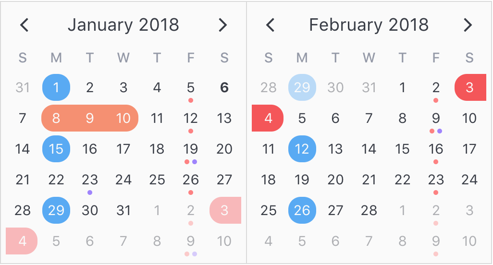

# Adding Custom Page Elements

Third party modules can be incorporated into BetterForms apps. This opens up en enormous library of open source and paid modules. You should have a good working knowledge of VueJS and how binding works.

The easiest modules to incorporate into BetterForms are Vue based. Most Vue Modules start with `v-someName`

Currently modules will need a CDN link and must install themselves. \(See limitations below\)

## Example: V-Calendar

We will add `v-calendar` a beautiful date picker.



To reference the source code we will add the CDN link by adding the following to the DOM Header insertions for you site. The first line adds the CSS style sheet, the second is for the module code.

```markup
<link rel='stylesheet' href='https://unpkg.com/v-calendar/lib/v-calendar.min.css'>
<script src='https://unpkg.com/v-calendar'></script>
```

This module installs itself and will be available in `HTML` elements.

In the documentation for this library \([https://vcalendar.io/](https://vcalendar.io/)\) we see:

```javascript
<v-calendar :attributes='attrs'>
</v-calendar
```

Here the `:attributes` key is bound to a variable called `attrs` To make the BetterForms compatible, we need to bind the `atributes` key to a BetterForms data source. We will use `model` like this: _\(remember: an attribute must have a colon in front of it to be compatible with Vue bindings\)_

```text
<v-date-picker 
    :available-dates='model.availableDates' 
    v-model='model.selectedDates'
    >
</v-date-picker>
```

The `v-model` in the component points to the data source used to populate the calendar.

This code is inserted into an HTML element and we are done!

## Limitations

There are some limitations when adding 3rd party libraries.

* Module libraries must be available via a CDN
* Modules must self install as a global Vue component
* Modules must not require initialization code and be ready for use as a Vue component
* Modules that are not Vue components can still be used but will often require writing small JS interface code to help patch them into the BF framework.
* Be sure to make not if the type of links as some are cached much slower than others, see: [https://forum.fmbetterforms.com/t/cdn-advice-if-your-site-is-slow-to-load/239](https://forum.fmbetterforms.com/t/cdn-advice-if-your-site-is-slow-to-load/239)

