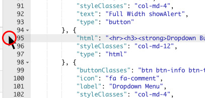
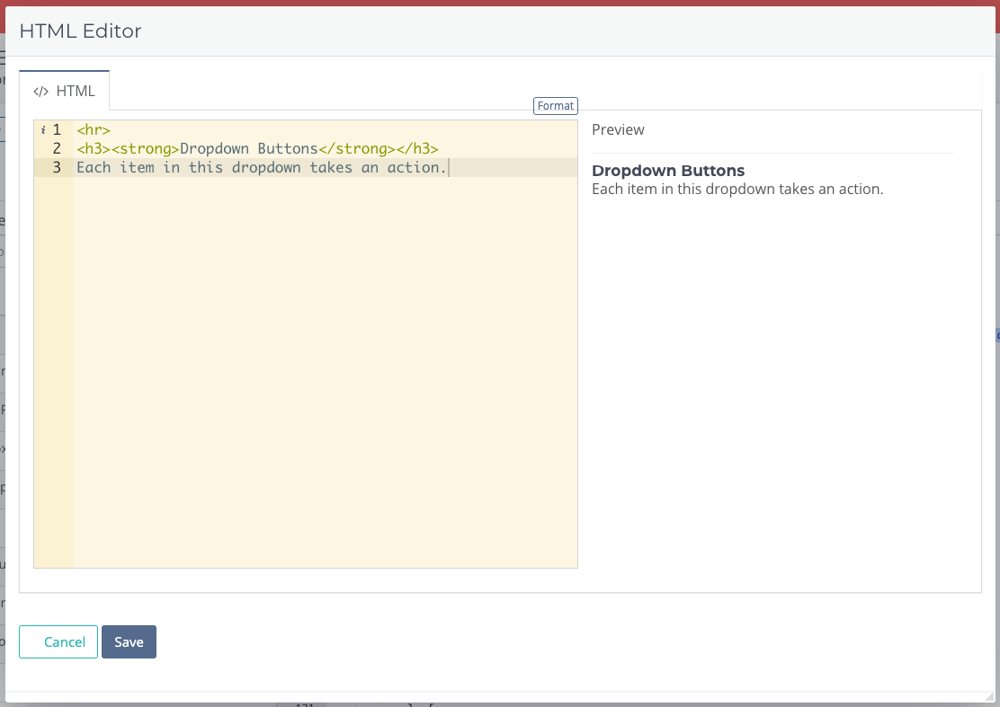

# HTML

The HTML element allows you to merge any HTML and inline CSS into your form layout. HTML source data can be in either (or both) the data `model` or the field `scmema`

| Key            | Value(s)   | Type   | Description                                                                                                                                                                                                                                            |
| -------------- | ---------- | ------ | ------------------------------------------------------------------------------------------------------------------------------------------------------------------------------------------------------------------------------------------------------ |
| type           | html       | string |                                                                                                                                                                                                                                                        |
| html           |            | string | raw HTML. if both a model and `html` code are supplied, the `html` code goes first.                                                                                                                                                                    |
| model          |            | string | raw HTML (VueJS) code                                                                                                                                                                                                                                  |
| dataModelScope | {optional} | string | if defined, the scope of the `model` object within the html will root to this data model path. This is used when you are building things that edit other things and want live data rendering. This is used in the HTML builder page of the admin site. |

### Example

```yaml
// you can use either body or model or both keys for HTML source code

{
  "html": "<h1>This is some HTML!</h1> It will display ahead of the model HTML",
  "model": "mySourceHtml",
  "type": "html",
  "styleClasses": "col-md-12"
},
```

Use of the model key for this element is helpful if you have HTML content that you want to generate in FileMaker and push to the browser. Otherwise, it can be left out entirely and you can build your own HTML elements using the [HTML editor](html.md#html-editor) and [VueJS Template syntax](../../../usage/formsoverview/working-with-html.md).

## HTML Editor

This powerful element allows you to add custom HTML and [VueJS Template syntax](../../../usage/formsoverview/working-with-html.md).

#### Opening the HTML Editor



When using [VueJS Template syntax](../../../usage/formsoverview/working-with-html.md), you'll see your [development data model](../../form-settings/data-model.md) displayed in the preview and can edit it in the Data Model tab.



This makes developing with custom code fast and easy.


**Remember:** The HTML editor works wherever there is a "html" key in the schema! This expands beyond the HTML element to [modals](../../actions-processor/actions\_overview/showmodal.md) and [slots](tables2.md#slots) of a [data table](tables2.md).

