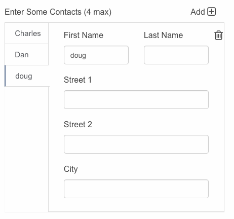

# Tabs

## Tab Modes

A tabs element can be constructed in either **Data Mode** or **Form Mode**. **Form mode** allows you to define each tab individually as its own form, very similar to how a tab element would work in FileMaker. **Data Mode** takes an array of data and generates a tab for each item in the array, with identical elements in each tab containers.

* To use Data Mode, set `"type": "vtabs"`
* To use Form Mode set `"type": "tabs_form"`

Otherwise, all other parts of this page apply to both modes.

Additional Keys

|                       | Type          | Description                                                                   |
| --------------------- | ------------- | ----------------------------------------------------------------------------- |
| onTabClicked\_actions | actions array | this key accepts an array of actions that are executed when a tab is clicked. |

Vertical Tabs give you the ability to contain repeating records (tab) of data and allow the user to add additional tabs.

v-tab's can contain full form schema. This means you can build forms within forms!



| Key           | Type   | Description                                                                                                                |
| ------------- | ------ | -------------------------------------------------------------------------------------------------------------------------- |
| tabLabelModel | string | Point this to the data model.field. It will be used to display on the tab.                                                 |
| min           | number | {optional} The minimum number of tabs the user is allowed to create. The delete icon will had when this number is reached. |
| max           | number | {optional} The maximum number of tabs the user is allowed to create. The add icons will hide when this number is reached.  |
| model         | array  | the data model must be initialized as an array. '_**\[ ]'**_                                                               |
| schema        | object | the schema object follows the same construct as schema of its parent. It only needs to contain a _**fields**_ array.       |

### Notes

Set the min and max values to the same number to permanently hide the add and delete icons. Data within your data models array will still render rows accordingly.

```yaml
// typical v-tab object
// DATA MODE

{
  "hint": "You can set the 'max' property to limit number of records",
  "label": "Enter Some Contacts (4 max)",
  "min": 1,
  "max": 4,
  "model": "contacts",
  "schema": {
    "fields": [
      {
        "inputType": "text",
        "label": "First Name",
        "model": "nameFirst",
        "styleClasses": "col-md-6",
        "type": "input"
      },
      {
        "inputType": "text",
        "label": "Last Name",
        "model": "nameLast",
        "styleClasses": "col-md-6",
        "type": "input"
      },
      {
        "inputType": "select",
        "label": "Street 1",
        "model": "street1",
        "styleClasses": "col-md-12",
        "type": "input"
      }
    ]
  },
  "styleClasses": "col-md-8",
  "tabLabelModel": "nameFirst",
  "type": "vtabs"
}
```
