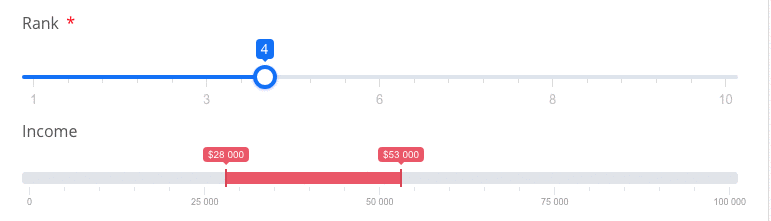

# rangeSlider

The range slider component is based in the `ion.rangeSlider` library and will require a DOM header link to include the module.

## Source Reference

Vue-form-generator: [https://vue-generators.gitbook.io/vue-generators/fields/optional\_fields/slider](https://vue-generators.gitbook.io/vue-generators/fields/optional\_fields/slider)

ion.rangeSlider.js: [http://ionden.com/a/plugins/ion.rangeSlider/index.html](http://ionden.com/a/plugins/ion.rangeSlider/index.html)

This element is a wrapper for the popular noUiSlider library.



Add the CDN references below into the DOM Header Insertions section of your site.

```
<!--rangeSlider CSS -->
<link rel="stylesheet" href="https://cdnjs.cloudflare.com/ajax/libs/ion-rangeslider/2.3.0/css/ion.rangeSlider.min.css"/>

<!--Plugin JavaScript file-->
<script src="https://cdnjs.cloudflare.com/ajax/libs/ion-rangeslider/2.3.0/js/ion.rangeSlider.min.js"></script>
```

## Example code snippet

```
{
  "label": "Rank",
  "styleClasses": "col-md-12 ",
  "max": 10,
  "min": 1,
  "model": "rank",
  "rangeSliderOptions": {
    "grid": true
  },
  "type": "rangeSlider"
}
```

### Theming

see docs for theming info here: [http://ionden.com/a/plugins/ion.rangeSlider/skins.html](http://ionden.com/a/plugins/ion.rangeSlider/skins.html)

use key `"skin"` to change theme.

```
"rangeSliderOptions": {
    "grid": true,
    "skin": "big"
  }
```
