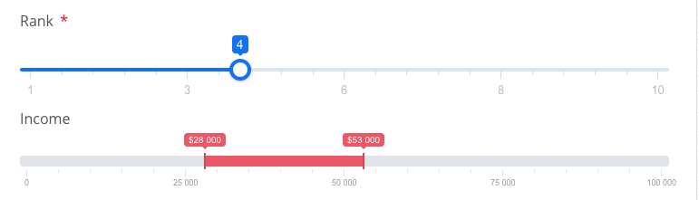

# rangeSlider

The live `rangeSlider` field uses the `ion.rangeSlider` jQuery plugin.

## Source Reference

Vue-form-generator: [https://vue-generators.gitbook.io/vue-generators/fields/optional\_fields/slider](https://vue-generators.gitbook.io/vue-generators/fields/optional\_fields/slider)

ion.rangeSlider.js: [http://ionden.com/a/plugins/ion.rangeSlider/index.html](http://ionden.com/a/plugins/ion.rangeSlider/index.html)



Add the CDN references below into the DOM Header Insertions section of your site.

```
<!--rangeSlider CSS -->
<link rel="stylesheet" href="https://cdnjs.cloudflare.com/ajax/libs/ion-rangeslider/2.3.0/css/ion.rangeSlider.min.css"/>

<!--Plugin JavaScript file-->
<script src="https://cdnjs.cloudflare.com/ajax/libs/ion-rangeslider/2.3.0/js/ion.rangeSlider.min.js"></script>
```

## Common Configuration Properties

| Property | Type | Description |
| :-- | :-- | :-- |
| `type` | `String` | Must be `"rangeSlider"` |
| `label` | `String` | Field label |
| `model` | `String` | Model key that stores either a single number or a two-item array |
| `placeholder` | `String` | Placeholder text |
| `disabled` | `Boolean` | Disables the control |
| `readonly` | `Boolean` | Makes the input read-only |
| `fieldOptions` | `Object` | Options passed directly into `$(el).ionRangeSlider(...)` |

## Example Schema Snippet

```
{
  "label": "Rank",
  "styleClasses": "col-md-12 ",
  "model": "rank",
  "fieldOptions": {
    "min": 1,
    "max": 10,
    "grid": true
  },
  "type": "rangeSlider"
}
```

## Runtime Notes

- The component requires the `ion.rangeSlider` library to be loaded globally.
- `fieldOptions.type` defaults to `"single"` if you do not provide it.
- When the slider type is `"double"`, the model is written as `[from, to]`.
- Otherwise, the model is written as a single numeric value.

### Theming

see docs for theming info here: [http://ionden.com/a/plugins/ion.rangeSlider/skins.html](http://ionden.com/a/plugins/ion.rangeSlider/skins.html)

Use key `"skin"` to change theme.

```
"fieldOptions": {
    "grid": true,
    "skin": "big"
  }
```
