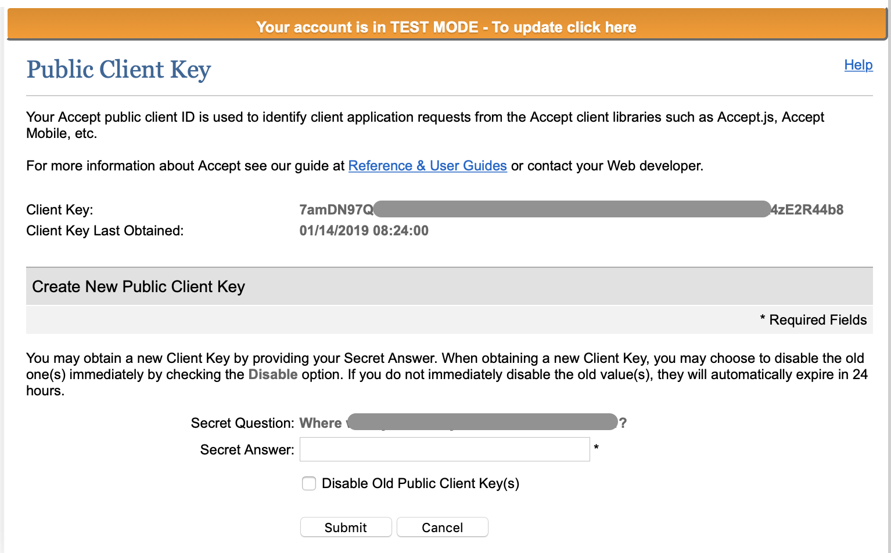

# Authorize.net

`authorize` Allows you to securely process payments via Authorize.net This component only renders the button and hands the secure transaction via Authorize.net's accept.js module. The workflow for this component requires a bit more work than the Stripe or PayPal payment gateways. Unlike those elements, `authorize` requires server side calls the the Authorize.net API to complete the transaction.

**Version:** >0.8.16


### This component documentation is work in progress


See [https://developer.authorize.net/api/reference/features/acceptjs.html](https://developer.authorize.net/api/reference/features/acceptjs.html) for workflow reference and deeper understanding of this component.

When the rendered button is clicked, a modal window is opened that will contain card capture information. This window is an iFrame and generated securely via the accept.js model. Once the payment information has been entered,

## Credentials

You will need to obtain credentials from the Authorize.net dashboard. The BetterForms component uses the public `apiLoginID` and `clientKey` values.

If you need to locate the public client key in Authorize.net, the dashboard screen looks like this:

<figure><figcaption></figcaption></figure>

| Key | Value(s) | Type | Description |
| --- | --- | --- | --- |
| `type` | authorize | string | Identifies the Authorize.net element |
| `model` |  | string | Data model key that will contain the response returned from Authorize.net |
| `apiLoginID` |  | string | Public API Login ID from Authorize.net |
| `clientKey` |  | string | Public client key used by AcceptUI |
| `buttonText` |  | string | Text displayed on the rendered button |
| `buttonClasses` |  | string | CSS classes applied to the button |
| `acceptUIFormBtnTxt` |  | string | Text shown on the AcceptUI submit button |
| `acceptUIFormHeaderTxt` |  | string | Header text shown in the AcceptUI dialog |
| `billingAddressOptions` | `{}` | object | Billing-address settings passed to AcceptUI |
| `sandBox` | `true` / `false` | boolean | If true, BetterForms loads the Authorize.net sandbox AcceptUI script |
| `onResponse_actions` | `[]` | array | Actions to run after AcceptUI returns a response |

```javascript
// Sample schema object
{
  "model": "authorize",
  "styleClasses": "col-md-4",
  "type": "authorize",
  "acceptUIFormBtnTxt": "Complete Payment",
  "acceptUIFormHeaderTxt": "Card Payment Information",
  "apiLoginID": "9vR4pUBE483",  
  "billingAddressOptions": {
    "required": true,
    "show": true
  },
  "buttonClasses": "btn btn-lg btn-primary",
  "buttonText": "Pay Now",
  "clientKey": "7amDN97QG6xkHGB4xdD2yd3BYvdZ49HFjp7j7477U282BYuwuheDMvk4zE2R44b8",
  "sandBox": true,
  "onResponse_actions": [{
      "action": "function",
      "function": "console.log('@onResponse: ', action.options.args[0])"
  }]
}
```

## Response Hook

After AcceptUI returns a response, BetterForms stores that response in the configured `model` key and runs `onResponse_actions` if you configured them.

This is **not** an automatic utility-hook flow by itself. If you want to send the payment token or opaque data to FileMaker, add a `runUtilityHook` action inside `onResponse_actions`.

For example:

```json
{
  "onResponse_actions": [{
    "action": "runUtilityHook",
    "options": {
      "type": "authorize"
    }
  }]
}
```

In practice, the response object contains values such as:

```json
{
  "messages": {
    "resultCode": "Ok"
  },
  "opaqueData": {
    "dataDescriptor": "COMMON.ACCEPT.INAPP.PAYMENT",
    "dataValue": "..."
  },
  "encryptedCardData": {
    "cardNumber": "XXXXXXXXXXXX4242",
    "expDate": "02/21"
  }
}
```
