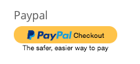

# PayPal

`paypal` Allows you to securely process payments via PayPal. This component only renders the button and hands the secure transaction via the PayPal API. You will have to add summary information around this component so the user knows what they are paying for.

This element in an implementation of [vue-paypal-checkout](https://github.com/khoanguyen96/vue-paypal-checkout)



This element allows you to take payments via PayPal.

When clicked, the payment workflow is initiated.

| Key              | Value(s)  | Type    | Description                                                                                                       |
| ---------------- | --------- | ------- | ----------------------------------------------------------------------------------------------------------------- |
| type             | paypal    | string  |                                                                                                                   |
| model            |           | string  | Data model key that will contain the PayPal response                                                              |
| amountKey        |           | string  | model key that holds the amount.                                                                                  |
| onPaypalEvent\_actions | \[] | array   | If supplied, these actions run for PayPal events. If not supplied, the component falls back to the default `runUtilityHook` / `onUtility` server-hook flow. |
| currency         |           | string  | Currency for the payment, for example `USD` or `CAD`                                                              |
| invoiceNumber    |           | string  | Optional invoice number passed to PayPal                                                                          |
| env              | `sandbox` or `production` | string | PayPal environment to use                                                                                         |
| itemsKey         | 'myItems' | array   | optional - model key that holds an array of items                                                                 |
| credentials      | {}        | object  | credential object,                                                                                                |
| style            | {}        | object  | PayPal defined styling of the button                                                                              |

### Reference

```javascript
// sample credential object
credentials: {
    sandbox: '<sandbox client id>',
    production: '<production client id>'
}
```

### Specifying Items

Optionally, according to the PayPal Payments API documents, you can list out any items along with your transaction.

For more information, PayPal Item List

```yaml
// Sample Items Object
myItems: [
    {
      "name": "hat",
      "description": "Brown hat.",
      "quantity": "1",
      "price": "5",
      "currency": "USD"
      },
      {
      "name": "handbag",
      "description": "Black handbag.",
      "quantity": "1",
      "price": "5",
      "currency": "USD"
      }
  ]
```

### Button Style

You can change the style of the button via a style object like so:

```javascript
{
    label: 'checkout',
    size:  'responsive',    // small | medium | large | responsive
    shape: 'pill',         // pill | rect
    color: 'gold'         // gold | blue | silver | black
}
```

### Complete Example Object

```yaml
{
  "label": "Paypal",
  "model": "files",
  "styleClasses": "col-md-8",
  "type": "paypal",
  "currency": "CAD",
  "locale": "ca",
  "env": "sandbox",
  "amountKey": "paymentAmount",
  "onPaypalEvent_actions": [{
    "action": "runUtilityHook",
    "options": {
      "type": "paypal"
    }
  }],
  "credentials": {
    "sandbox": "AfGtki3XCbYBRxGWWY6YQlqRio82v5Jp6oPC7FJ9_0BLOlT3Z5KXLgPVmVGoCtZQTDuaYhrCM7ez3P9g",
    "production": "AcWg3pjwEtxVCX_UNrmb8GDvh3ntnP7zeDbIfVKRvDVWHr2UkkYUM9ze0r4-H4HkhzGtBEXE21iFsmg2"
  },
  "style": {
    "label": "checkout",
    "size": "responsive",
    "shape": "pill",
    "color": "gold"
  }
}
```

## Notes

- The runtime reads the amount from `model[amountKey]`, so use `amountKey` rather than a literal `amount` property on the element.
- `onPaypalEvent_actions` is the user-facing schema key. BetterForms translates it into the runtime callback function internally.
