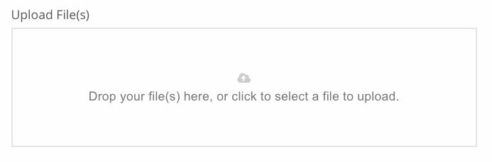

# dropzone

`dropzone` Allows you to easily add a drag and drop file upload component to any form. Files are posted to any upload service such as [file.io](https://www.file.io/#one) and [uploadcare](https://uploadcare.com). The data model is passed back all relevant meta information.

#### File.io 

The default configuration uses `file.io` as ephemeral storage. Using additional options you can adjust the length of time a file lives for \(default is 2 weeks\). Typically upon form submission, your FileMaker hook script would insert the data from the storage location into a container etc in your database.

#### AWS S3

Files can be uploaded to an AWS S3 bucket. You will need to first provision the bucket.

#### Base64


| Key | Value\(s\) | Type | Description |
| :--- | :--- | :--- | :--- |
| type | `dropzone` | string |  |
| model |  | Array | Array of uploaded file metadata. Does not have to be predefined. |
| useCustomSlot | \(\) | boolean | If true, then the HTML in the `html` key will be inserted into the target drop area  , defaults false |
| includeB64 |  | boolean | If true, base64 encoded data is returned in the response, defaults false. |
| options |  | object | Object of additional options. These will override defaults. and are passed directly into dropzone.js |

## Minimal Usage Example

```yaml
{
  "label": "Upload File(s)",
  "model": "files",
  "styleClasses": "col-md-8",
  "type": "dropzone",
  "options": {
    // all additional items and overrides go here
  }
}
```



## Additional Options

You can totally customize the dropzone component and control things like file size limits and number of files uploaded.

### Reference

[vue-dropzone options](https://github.com/rowanwins/vue-dropzone#props) [http://www.dropzonejs.com/\#configuration](http://www.dropzonejs.com/#configuration)

## Example Data model

```yaml
[
  {
    "file": {
      "upload": {
        "progress": 100,
        "total": 67666,
        "bytesSent": 67666,
        "filename": "1404329470648.jpeg"
      },
      "status": "success",
      "previewElement": {},
      "previewTemplate": {},
      "_removeLink": {},
      "accepted": true,
      "processing": true,
      "xhr": {},
      "width": 450,
      "height": 385
    },
    "response": {
      "success": true,
      "key": "RSadAH",
      "link": "https://file.io/RSadAH",
      "expiry": "14 days"
    }
  }
]
```

### Reference

[vue-dropzone options](https://github.com/rowanwins/vue-dropzone#props)

[http://www.dropzonejs.com/\#configuration](http://www.dropzonejs.com/#configuration)

