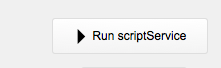

# Developer Mode

Developer mode is a special mode use to help configure, test and debug FM BetterForms

### Enabling

# Troubleshooting

Debugging your developer hooks is easy. The inbox layout helps to probe into both the requests coming from the web app as well as the result that get sent back to the web app.

For tracing set break points at the beginning of your hook and manually run the `Run scriptService`  to begin processing the inbox payload.

### Common Issues

