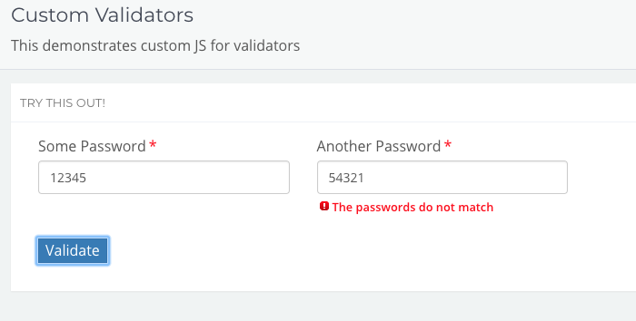

# Custom Validators

You can define your own Javascript custom validation calculation that will fire the same as the regular validators.

By selecting the `validator` type to `calc` and adding a calculation and error message you can have excellent control over validation.



```yaml
// example JSON for an element with custom validation
[
  {
    "inputType": "text",
    "label": "Some Password",
    "model": "password1",
    "placeholder": "",
    "styleClasses": "col-md-3",
    "type": "input",
    "required": true,
    "validator": "string"
  },
  {
    "inputType": "text",
    "label": "Another Password",
    "model": "password2",
    "placeholder": "",
    "styleClasses": "col-md-3",
    "type": "input",
    "required": true,
    "validator": "calc",
    "validator_calc": "model.password1 == model.password2",
    "errorMsg": "The passwords do not match"
  }
]
```
