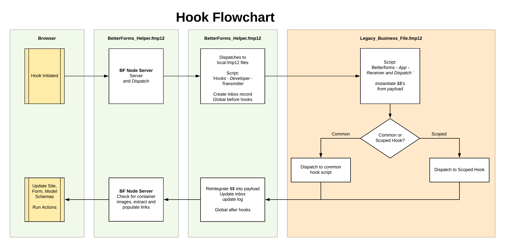

# Common Hooks

Common hooks are **server calls** that are available across the application, rather than being tied to a single page.

For FileMaker developers, this is the key distinction:

- **Hooks** are server-side calls into your FileMaker scripts.
- **Actions** and **named actions** are client-side workflows.
- A named action can include a `runUtilityHook` action when a workflow needs to call a server hook.

Use **Common Hooks** for app-wide authentication, registration, notification, and API-entry logic. Use [Scoped Hooks](./hooks.md) for page-specific server logic such as `onUtility`.

## Common Hook Set Name

`commonHookSetName` is part of how BetterForms routes common hook calls from the web application into the correct FileMaker script set.

- Keep the name short and app-oriented, for example `portal`, `admin`, or `cart`.
- This belongs mainly to setup and architecture, so this page only mentions it briefly.
- The important practical point is that multiple BetterForms front ends can point at the same back end while still using different common hook handlers.

This older flowchart is still useful if you want a high-level picture of how a hook request moves from the browser through BetterForms and into your FileMaker hook scripts:

<figure><figcaption></figcaption></figure>

## Common Hooks At A Glance

| Hook | Purpose | Typical Trigger |
| --- | --- | --- |
| `onLogin` | Post-login server-side business logic | Successful authentication |
| `onRegistration` | Post-registration server-side business logic | Successful `authRegister` |
| `onAuthNotifier` | Sends verification, reset, and magic-link notifications | Auth email / notification flows |
| `onBeforeRegistration` | Allows or blocks certain registrations before user creation | OAuth or controlled registration flows |
| `onApiCall` | Handles the universal BetterForms API callback endpoint | Requests to `/api*` |

## onLogin

`onLogin` runs after a user has authenticated successfully.

This is a **server hook**, not a client action. Use it when you want FileMaker-side logic to run after login, for example:

- loading app-level flags or user-related data
- returning actions based on roles or business rules
- overriding the post-login destination

### Redirect Behavior

BetterForms does **not** require you to always return a `path` action from `onLogin`.

The current redirect order is:

1. If `onLogin` returns a `path` action, that takes priority.
2. Otherwise, if the login URL included a `redirect` query parameter, BetterForms navigates there.
3. Otherwise, BetterForms falls back to `/`.

That means you should only return a `path` action when you intentionally want to override the normal post-login destination.

### Relationship To Client `onLogin`

BetterForms can also run a client-side named action called `onLogin`.

Keep the distinction clear:

- `onLogin` on this page is the **server hook** called through FileMaker
- `site.content.namedActions.onLogin` is a **browser-side named action**

In the real login flow, both can be involved. Treat them as separate workflow layers rather than relying on a strict "one always runs before the other" mental model.

Use the server hook for FileMaker business logic and returned actions. Use the client named action for browser-side UI or state work.

### What You Can Return

`onLogin` can return actions just like other server hooks. Those actions are inserted back into the active action thread and executed in the client.

In practice, this means:

- FileMaker decides the business logic
- BetterForms runs any returned actions in the browser
- a returned `path` action changes where the user goes next

## onRegistration

`onRegistration` runs after `authRegister` successfully creates a user.

Use it for server-side logic such as:

- creating related records
- setting default values
- storing app-specific user metadata
- returning follow-up actions

This hook has access to the newly created user information and can return actions back to the client workflow.

## onAuthNotifier

`onAuthNotifier` is the common hook used for authentication-related notifications.

This is typically where FileMaker sends:

- verification emails
- password-reset emails
- magic-link emails
- optional follow-up notifications after certain auth events

The current notifier flow sends this hook a `type` describing the auth event plus user data and host/subdomain context so FileMaker can build the correct outbound message.

If your app uses registration, password reset, or magic-link login, this hook is one of the most important common hooks to configure correctly.

## onBeforeRegistration

`onBeforeRegistration` is used when you need to decide whether a registration should be allowed before the user is created.

This is especially relevant for controlled OAuth registration flows.

Typical uses:

- allow registration only for approved domains
- block automatic user creation unless a FileMaker rule passes
- inspect query parameters or inbound context before creating the user

If your OAuth setup depends on controlled user creation, this hook should be documented and implemented as part of that flow.

## onApiCall

`onApiCall` is the common hook behind the BetterForms universal API callback endpoint.

Use it when you want FileMaker to respond to inbound API requests at `/api*`.

This hook is documented in more detail here:

- [API Callback Endpoint](./callback.md)

## Related Pages

- [Scoped Hooks](./hooks.md)
- [Lifecycle Hooks](./lifecycle-hooks.md)
- [Authentication](../authentication/README.md)
- [Authentication Actions](../actions-processor/authentication-actions.md)
- [API Callback Endpoint](./callback.md)
- [Keeping Keys Private](./payloadobject.md)
- [Reducing Payload Size](./env_vars.md)

