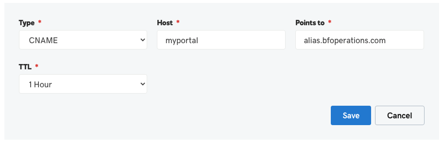

# Custom Domains

FM BetterForms generates custom subdomains with the `*.fmbetterforms.com` domain name space and will automatically generate and maintain a security certificate For custom domains you will have to follow a few steps to configure.

If your account permits it, you can map fully customized domains to BetterForms servers.

### Custom Domain Configuration

1. To map the `portal.mycompany.com` domain to one of your apps, visit your DNS provider / registrar ( _eg GoDaddy_ ) and add a **CNAME** record for `portal.mycompany.com` pointing to `alias.bfoperations.com`
2. In the BetterForms editor under your apps environment page, add your new custom domain.
3. Check if your CNAME record has propagated. You can check here: [https://dnschecker.org/#CNAME](https://dnschecker.org/#CNAME)\
   BetterForms will not be able complete your domain configuration until this step has been done.
4. In the BetterForms App editor under the deployments section, add your custom domain. BetterForms servers will complete the connection and generate the security certificate.

### **Naked Domains**

#### ( update needed )

###
