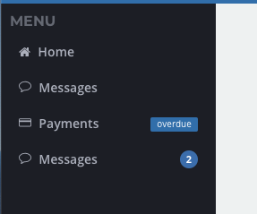

# Navigation

You can define a navigation object in the site settings. This allows you to create dropdown drop down menus and their children.

### Navigation Object

The navigation is defined in the **Appearance &gt; Navigation** tab of your [site settings](./). It should be an array of objects, with each object defining a section of the navigation. Most apps may only have 1 navigation section.

| Key | Type | Description |
| ---: | :---: | :--- |
| `sectionLabel` | _string_ | This label describes what the menu section context is. It is not selectable. |
| `subs` | _array_ | This is a dropdown style parent menu that will hold sub menus. BetterForms looks to see a `subs` key and if present will consider this the parent. |

### Subs Array

At the base of the navigation menu section, the subs array of objects should contain your list of menu items. Further `subs` keys beyond here will create sub-menus.

| Key | Type | Description |
| ---: | :---: | :--- |
| `label` | _string_ | This label is the text area of each menu item |
| `subs` | _array_ | This is a dropdown style parent menu that will hold sub menus. BetterForms looks to see a `subs` key and if present will consider this the parent. |
| `path` | _string_ | navigational sub path e.g.: /forms/123 Use this to gain direct access to another part of your app. Alternatively, you can use a [path action](../actions-processor/actions_overview/path.md). |
| `actions` | _array_ | If a navigation item has an `actions` key then it is considered an actions type. The actions\[ \] array can contain several actions that are chained together and passed to the [actions processor](../actions-processor/). |
| `visible` | _boolean_ | _{optional}_ Controls if item is visible. This key will also accept a `visible_calc` function for conditional visibility, but the scope of the function is bound to the entire site instead of a specific page.  |
|  |  |  |
| `html` | _string_ | If key present, then the HTML value is inserted as the navigation menu item |

### Element Type Order

The navigation parser classifies the navigation elements in the following hierarchy:

* `actions` if key present, item treated as action trigger only
* `path` if path key present, item handled as regular router link
* `subs` If key present , item hand as a sub menu
* `html` If key present, item is handled as html

## Examples



```yaml
// Full Navigation example
[
  {
    "sectionLabel": "Menu",
    "subs": [
      {
        "label": "Home",
        "icon": "fa fa-home",
        "path": "/dash"
      },
      {
        "label": "Some Form",
        "icon": "fa fa-check-square-o",
        "path": "/form/123-12-312-3123"
      },
      {
        "label": "A Dropdown Menu",
        "icon": "fa fa-car",
        "subs": [
          {
            "icon": "fa fa-car",
            "label": "Some Form",
            "path": "/dash"
          },
          {
            "icon": "fa fa-fw fa-play",
            "label": "Show Alert",
            "actions": [
              {
                "action": "showAlert",
                "options": {
                  "title": "Hello World!",
                  "text": "This is the Alert body, you will take to the dash",
                  "type": "success"
                }
              }
            ]
          },
          {
            "icon": "fa fa-fw fa-list-ol",
            "label": "Show Modal",
            "actions": [
              {
                "action": "showModal",
                "options": {
                  "body": "This model has a second action, you willl be taken to the /dash",
                  "icon": "success",
                  "options": {},
                  "overlayTheme": "dark",
                  "text": "This is a Modal"
                }
              },
              {
                "action": "path",
                "options": {
                  "path": "/dash"
                }
              }
            ]
          }
        ]
      }
    ]
  }
]
```



In the same way that `visible_calc` works for fields, you can also apply to individual items or entire sections of the nav menu. Be aware that from the context of the nav menu, you don't have access to the data model of the page, and may need to reference site-global variables as set in the _Environment &gt; App Model_ section of your site settings.







Using an HTML nav item, you can add badges

```text
[{
    “sectionLabel”: “Menu”,
    “subs”: [{
        “exact”: true,
        “icon”: “fa fa-home”,
        “label”: “Home”,
        “path”: “/”
    }, {
        “html”: “<a href=\“/#/messages\” title=\“Messages\“>\n    <i class=\“fa icon-credit-card\“></i> Payments\n    <span class=\“pull-right badge badge-info\“>overdue</span>\n</a>”    },{
        }
    ]
}]
```






