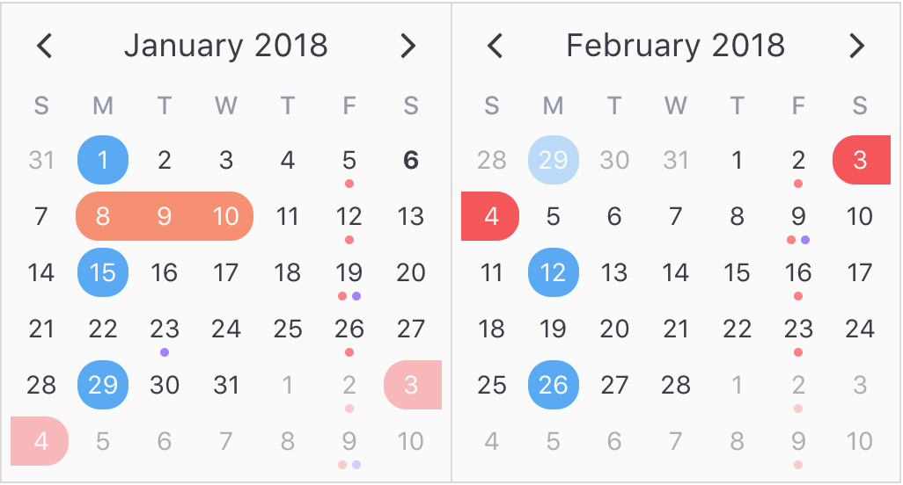

# 3rd Party Elements

Third party modules can be incorporated into BetterForms apps. This opens up en enormous library of open source and paid modules. You should have a good working knowledge of VueJS and how binding works.

The easiest modules to incorporate into BetterForms are Vue based. Most Vue Modules start with `v-someName` 

Currently modules will need a CDN link and must install themselves.

### Example: V-Calendar

We will add `v-calendar` a beautiful date picker.



To reference the source code we will add the CDN link by adding the following to the DOM Header insertions for you site. The first line adds the CSS style sheet, the second.

```text
<link rel='stylesheet' href='https://unpkg.com/v-calendar/lib/v-calendar.min.css'>
<script src='https://unpkg.com/v-calendar'></script>
```

This module installs itself and will be available in `HTML` elements.

To use is we see that the docs show 

```text
<v-calendar :attributes='attrs'>
</v-calendar
```

Here the `:attributes` key is bound to a variable called `attrs` To make the BetterForms compatible, we need to bind the `atributes` key to a BetterForms data source. We will use `model` like this: _\(remember only attributes that have the colon in front of them have Vue bindings.\)_

```text
<v-date-picker 
    :available-dates='model.availableDates' 
    v-model='model.selectedDates'
    >
</v-date-picker>
```

The `v-model` in the component  points to the data source used to populate the calendar.

This code is inserted into an HTML element and we are done!


Docs: [https://vcalendar.io/](https://vcalendar.io/)

