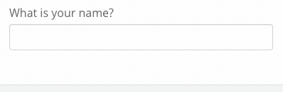

# HTML & VueJS

The BetterForms framework allows you to dig deep into the low levels of HTML code and still keep the benefits of a framework and reactivity. Many components have html compatible keys or accept slots that allow HTML to be rendered. BetterForms uses [VueJS](https://vuejs.org) under the hood to keep all the elements working together.



## Injecting VueJS syntax

You can harness the full power of VueJS the html rendering engine inside of BetterForms but simply adding Vue html syntax into your `HTML` code. When you use Vue, it maintains a link to the data in your data model and wherever that data is referenced so changes made to the data model will reflect instantly on the page.



**Here's just a few things you can do with VueJS Syntax:**

* Render merged data from the `data model`
* Build tables and other repeating data. (see example below)
* Execute all actions and pass data to those actions.


#### How do I know when to use `{{curly-brackets}}` or not?

The \{{\}} syntax is _only_ for injecting JavaScript into **HTML** code. Everything that you stick inside of of the curly brackets is actually just JavaScript. Vue is the glue that allows you combine HTML and JS and dynamically insert data (as calculated by the JS) into the HTML of your page.

**Remember:** the contents of the curly brackets is a single line of **JavaScript** and must evaluate to return a value. However, you only need to add the curly brackets if you're trying to place the result of that value into HTML code.


### Examples



```yaml
// the data model
{
    "nameFirst": "Jim",
    "nameLast": "Bob"
}
```

```yaml
// an HTML element
{
  "html": "<h2>My name is {{model.nameFirst}}</h2>",
  "styleClasses": "col-md-12",
  "type": "html"
}
```



Example Data Model:

```yaml
// the data model
{
    "items": [{
        "name": "Racecar",
        "qty": 2
    },{
        "name": "Wheels",
        "qty": 30
    }]
}
```

HTML code to build a table from the array

```markup
<table class="table">
    <thead>
        <tr>
            <th>Quan</th>
            <th>Name</th>
        </tr>
    </thead>
    <tbody>
        <tr v-for="line in model.items"> 
            <td>{{line.qty}}</td> 
            <td>{{line.name}}</td> 
        </tr>
    </tbody>
</table>>
```


Note that the `line` variable is declared on line 9. It can be set an anything and then is referenced later on lines 10 & 11 to get at the individual objects of the array.




## Other JavaScript Libraries

BetterForms is bundled with the following JS libraries:

* **MomentJS** - working with dates and times
  * [https://momentjs.com/docs/#/displaying/](https://momentjs.com/docs/#/displaying/)
* **NumeralJS** - formatting numbers
  * [http://numeraljs.com/#format](http://numeraljs.com/#format)
* **Lodash** - any useful function you can imagine
  * [https://lodash.com/docs/](https://lodash.com/docs/)

You can access these libraries anywhere where JavaScript can be inserted, including these curly brackets
