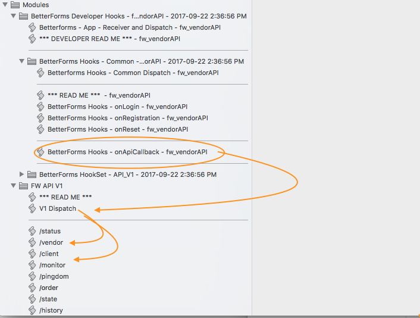

# API Callback Endpoint

## onCallback API Endpoint

### onCallback

This hook gives the developer access to a universal API endpoint. This can be used for any external callbacks callbacks or as an endpoint serving data.

This service can act as a universal endpoint and service multiple content types. The default is JSON but this can also be changed to others \(see below\).

### Endpoint

`/api*`

### Uses:

* Callback for integrating various services
* Document download endpoint
* App entry point for passing data when integrating from another system. _Eg. A user clicks a link in your online e-Connerce store and that link hits the BetterForms API callback. This action passes some data that launches the user cart session._

### Supported Request Types

* plain text
* application/json
* application/xml
* text/json
* text/\* - any text content type including text/xml

### Supported Methods \(verbs\)

* GET
* POST
* PUT
* PATCH
* DELETE

The hook is passed all header, query and body data as well as the request type \(located in `$params.method`\)

Set the `$response` var to the data you want to be returned.

Set the `$contentType` var to one of the following to return that content type and set the correct headers for the outbound data.

| $contentType values | Content Type |
| :--- | :--- |
| empty or null / unset or 'json' | JSON |
| 'html' | returns $response as html with headers set accordingly |
| 'text' | returns $response as plain text. |
| 'xml' | returns $response as xml with headers set accordingly |

| Surfaced $vars | Description |
| :--- | :--- |
| empty or null / unset or 'json' | JSON |
| $payload | the standard BetterForms Payload body object see [Payload Object](../payloadobject.md) |
| $data | returns $response as plain text. |
| $body | if method supports a body, this contains the serialized body string |
| $params | object containing header, method and query objects |
| $mehod | The method verb name |

### Performance

You can expect finite performance from this API handler. Initial tests show about 20 concurrent calls or about 1800 calls per minute can be consistantly achieved. This is dependent on server performance also.

### Suggested Design Pattern and Notes


If you are returning JSON, make sure $response is set to a \`JSONObject\` type. For XML, and other custom serialized responses you an set $response to the string you want to return.


Keeping your API handler scripts orderly is key to stability and ease of code maintenance. If your API is handling more than one simple task it is recommended you use the example multi-endpoint script structure.

The image below shows a best practice for structuring endpoints and allows for easy API versioning down the road.

The _concern_ of each endpoint is generally not to do business logic but to gather required data and format the response suitable to be returned to your calling server.



Here the main common hook script `BetterForms - onAPICallBack ...` acts as a dispatcher for each version. The `V1 Dispatcher` script then parses out each /endpoint and dispatches accordingly. For future debugging the head of each script has a logging step also.

```yaml
// Sample inbound request 

    "params": {
      "headers": {
        "accept": "*/*",
        "accept-encoding": "gzip, deflate",
        "cache-control": "no-cache",
        "connection": "keep-alive",
        "content-type": "application/json",
        "cookie": "PHPSESSID=kmr6khj4nlruspai6tfiv0fcf7",
        "host": "mycallingdomain.com",
        "myheaderkey": "12345HEADERKEY0000",
        "postman-token": "2630f738-8f01-49af-acc6-556437a4a23b",
        "user-agent": "PostmanRuntime/6.2.5",
        "x-forwarded-for": "99.254.153.139",
        "x-forwarded-port": "443",
        "x-forwarded-proto": "https",
        "x-region": "usw"
      },
      "method": "GET",
      "provider": "rest",
      "query": {
        "key1": "1",
        "key2": "2"
      }
    }
  }
```

## Api Best Practices

### Processing Time

Keep your script calls to a minimum run time if your script is expecting to have a lot of traffic and the process takes a long time. One common technique for long process times is to queue up the process and return the caller back a token or status of `processing` etc.

### Use workflow processing queues when needed

If you have a process that for example sends out several emails with a generated report the calling server will probably time out. Instead queue up the work flow and return just the parts of the data that can be prepared quickly.

