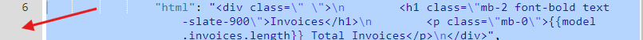
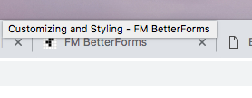

# Customizing and Styling

### Optional Components

You can hide or show various parts of the user interface

* Left Navigation Bar
* Header
* Title Block

Controls for elements are found under the `Appearance` tab of the site editor.

### Navigation

Navigation menu options can be configured in the navigation tab of the site editor.

### Theme Template

The default theme template is your starting point for customization. T0 browse around the theme template select it from the left sidebar navigation. This opens a new browser tab. From here you can inspect the underlaying HTML of page objects such as buttons etc. This allows you to see the CSS classes that are used to compose the element.

### Slots

Slots allow you to inject custom code fragments into various locations around the UI,

Slots See Slots documentation.

### Loaders

### Integration Methods

Your apps can being deployed or integrated with several methods.

* Regular domain / direct access app - This is a basic web site style page, most common.
* Embedded `iFrame` app using a code snippet like this to embed your application into an existing web site. Styles from the parent site will not alter styles within your App. &lt;iframe src="[https://hms.fmbetterforms.com/](https://hms.fmbetterforms.com/)" width="100%" height="800px" style="font-size: 110%; border: 0; "&gt;&lt;/iframe&gt;`<iframe src="https://myapp.fmbetterforms.com/" width="100%" height="800px" style="font-size: 110%; border: 0; "></iframe>`
* Button Launch - By adding a button on an existing site, you can open a new tab to launch your app.

## Loaders

You can customize the default animated page loader. Any HTML compatible image, SVG, GIF etc will be loaded during page transitions. You can find the custom loaders editor from the `site -> appearance -> loaders` tab of the site editor.

#### Loader Resources 

 [http://svgcircus.com/](http://svgcircus.com/) - Generate custom spinners.

[https://loading.io/](https://loading.io/) - Many animated SVG's \(can right click on page to see source code.

Google Search for other tools: [https://www.google.com/search?ei=sogvXIiDK8fLjwTYiJPYBQ&q=animate+svg+online&oq=animate+svg+online&gs\_l=psy-ab.3..0i7i30j0j0i8i30j0i30.6239.6748..7301...0.0..0.103.271.2j1......0....1..gws-wiz.......0i71j0i8i7i30.V\_EkTuZrlMw](https://www.google.com/search?ei=sogvXIiDK8fLjwTYiJPYBQ&q=animate+svg+online&oq=animate+svg+online&gs_l=psy-ab.3..0i7i30j0j0i8i30j0i30.6239.6748..7301...0.0..0.103.271.2j1......0....1..gws-wiz.......0i71j0i8i7i30.V_EkTuZrlMw)


All elements within a form schema can have a styleClasses key that can take a string of space separated CSS classes. The below example adds the class `my-red-box` to an input element.

```text
{
  "inputType": "text",
  "label": "My Input",
  "model": "field1",
  "styleClasses": "col-md-3 my-red-box",
  "type": "input"
}
```

This class is defined in the CSS section of the Site / Appearance as follows:

```text
.my-red-box {
    border-width: 2px;
    border-color: red;
    border-style: solid;
    padding: 20px;
}
```

Resulting is something similar to the following:



#### Form/ page Classes

You can target specific forms \(pages\) by adding class\(es\) to the `styleClasses` key of the `formSchema.form` section on the `misc.` tab of the form editor.

### Default Theme Colors

BetterForms has several default site theme colors. This can act as a starting point for your app. Themes are selected under site / appearance.

Some elements have an additional classes key for targeting internal components to that element. Buttons are an example of this. The `buttonClasses` key in this case allows you to target the button itself and not the wrapping object around the button.

### CSS

Site wide CSS is configured via the `appearance -> CSS` section the BF editor.

#### Page scoped classes

To target specific forms in your app, you can add a `styleClasses` key. This will allow you to still keep your CSS in a single location and theme pages separatly.


### Favicon

The `favicon` is the custom icon that is located in the tab of the browser. Adding the Favicon is easy and can be done one of two ways.

1. The icon must be hosted from a secure HTTPS site of most browsers will prevent it from loading.  
2. An alternate to hosting the favicon is to b64 inline encode it. This site allows you to easily convert a favicon to a `<>` tag that can be placed in the Header Insertions area of your site editor. [https://xaviesteve.com//pro/base64.php](https://xaviesteve.com//pro/base64.php)



```markup
// Sample b64 link tag 
<link rel="shortcut icon" href="data:image/x-icon;base64,AAABAAE">
```


