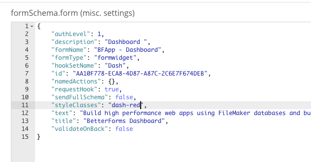

# Customizing and Styling

## Optional components

You can hide or show various parts of the user interface

* Left Navigation Bar
* Header
* Title Block

Controls for elements are found under the `Appearance` tab of the site editor.

## Navigation

Navigation menu options can be configured in the navigation tab of the site editor.

## Slots

Slots allow you to inject custom code fragments into various locations around the UI,

Slots See Slots documentation.

## Loaders

Custom loader / spinners can be added. Animated SVG's or HTML can be injected via the `appearance -> loaders` tab of the site editor.

## Default Theme Colors

BetterForms has several default site theme colors

## CSS

Site wide CSS is configured via the `appearance -> CSS` section the BF editor.

You can target specific forms \(pages\) by adding class\(es\) to the `styleClasses` key of the `formSchema.form` section on the `misc.` tab of the form editor.

### Favicon

The `favicon` is the custom icon that is located in the tab of the browser. Adding the Favicon is easy and can be done one of two ways.

1. The icon must be hosted from a secure HTTPS site of most browsers will prevent it from loading.  
2. An alternate to hosting the favicon is to b64 inline encode it. This site allows you to easily convert a favicon to a `<>` tag that can be placed in the Header Insertions area of your site editor. [https://xaviesteve.com//pro/base64.php](https://xaviesteve.com//pro/base64.php)

`// Sample b64 link tag   
<link rel="shortcut icon" href="data:image/x-icon;base64,AAABAAE`

