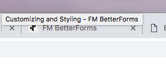

# Favicon

The `favicon` is the custom icon that is located in the tab of the browser. Adding the Favicon is easy and can be done one of two ways. The `<link>` gets added to the [DOM Header Insertions](../../reference/site-settings/) area of the site settings.

1. The icon must be hosted from a secure HTTPS site of most browsers will prevent it from loading. \\
2. An alternate to hosting the favicon is to b64 inline encode it. This site allows you to easily convert a favicon to a `<>` tag that can be placed in the Header Insertions area of your site editor.\
   [https://xaviesteve.com//pro/base64.php](https://xaviesteve.com/pro/base64.php)



```markup
// Sample b64 link tag 
<link rel="shortcut icon" href="data:image/x-icon;base64,AAABAAE">
```
